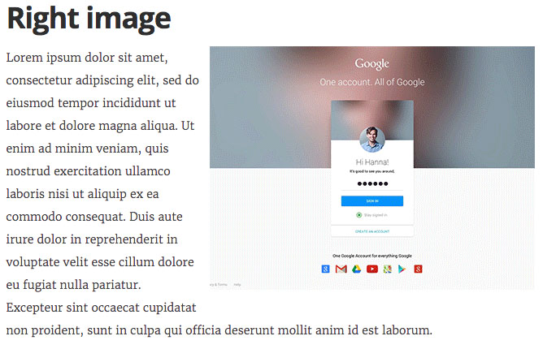
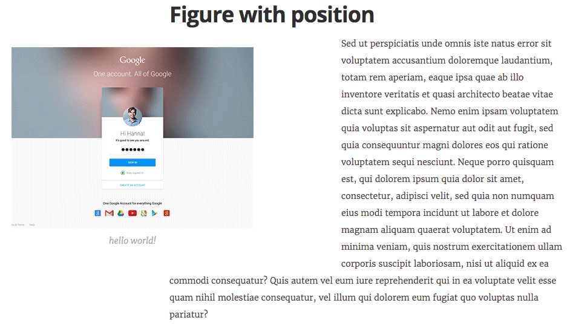
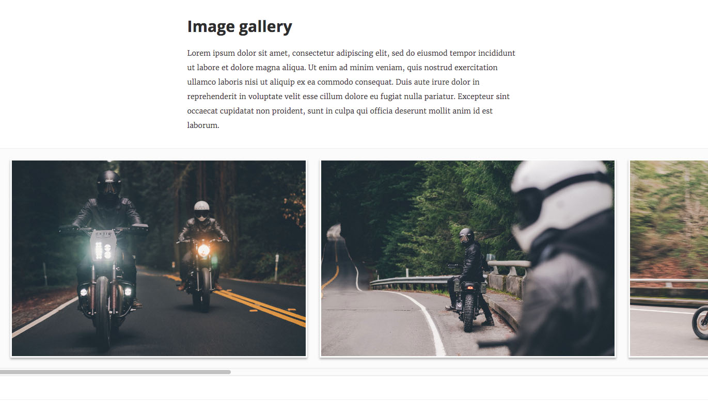

## Writing markdown

This theme support some cool styles to let you write a more elegent and rich-style article, such as *preface*, *image gallery* and so on. Basically it just need you to wrap your content in a HTML tag, like this:

```html
<div class="preface">
    Your preface here
</div>
```

So there is no magic. But you should also know that, markdown parser won't parse the markdown syntax inside the HTML tag, except the image syntax. So if you're writing something like this:

```markdown
<div class="preface">
This is *some* preface.
</div>
```

The result will just print `*some*`, instead of transform it to italic style.

### How to add preface

Wrap your preface in a `div` tag with `preface` class.

```markdown
<div class="preface">
Here is your preface...
</div>
```

### How to add tip

Wrap your tips content in a `div` tag with `tip` class.

```markdown
<div class="tip">
Lorem ipsum dolor sit amet, consectetur adipiscing elit, sed do eiusmod tempor incididunt ut labore et dolore magna aliqua. Ut enim ad minim veniam, quis nostrud exercitation ullamco laboris nisi ut aliquip ex ea commodo consequat. Duis aute irure dolor in reprehenderit in voluptate velit esse cillum dolore eu fugiat nulla pariatur. Excepteur sint occaecat cupidatat non proident, sunt in culpa qui officia deserunt mollit anim id est laborum.
</div>
```


### How to add author to quote

Just add a `<cite></cite>` tag below your quote. 

Demo: [Post page demostration](https://blog.serenader.me/ghost-theme-demostration-decent-2/#thestandardloremipsumpassageusedsincethe1500s)

```markdown
> Our destiny offers not the cup of despair, but the chalice of opportunity. So let us seize it, not in fear, but in gladness.
> 
> <cite>——R.M. Nixon</cite>
```


### How to add image with caption

Wrap your image with a `<figure></figure>` tag, and place your caption in a `<figcaption></figcaption>` tag. 

Demo: [Post page demostration](https://blog.serenader.me/ghost-theme-demostration-decent-2/#section11032ofdefinibusbonorumetmalorumwrittenbyciceroin45bc)

```markdown
<figure>

<figcaption>This is figcaption. A beautiful picture.</figcaption>
</figure>
```


### How to add image with alignment

Add a hash that contain alignment in your image's url. 

Demo: [Post page demostration](https://blog.serenader.me/ghost-theme-demostration-decent-2/#section11032ofdefinibusbonorumetmalorumwrittenbyciceroin45bc)

```markdown


```



### How to add image with caption and with alignment

Simply add a class `left` or `right` to your `<figure></figure>` tag. 

Demo: [Post page demostration](https://blog.serenader.me/ghost-theme-demostration-decent-2/#section11033ofdefinibusbonorumetmalorumwrittenbyciceroin45bc)

```markdown
<figure class="left">

<figcaption>hello world!</figcaption>
</figure>
```



### How to add fullscreen image

Wrap your image with an element that has a `large` class. 

Demo: [Post page demostration](https://blog.serenader.me/ghost-theme-demostration-decent-2/)

```markdown
<div class="large">

</div>
```

### How to add fullscreen image with caption

Give your `<figure></figure>` a `large` class. 

Demo: [Post page demostration](https://blog.serenader.me/ghost-theme-demostration-decent-2/#1914translationbyhrackham)

```markdown
<figure class="large">

<figcaption>wow so handsome</figcaption>
</figure>
```

### How to add image gallery(album)

Place your images within an element that has a `album` class. 

Demo: [Post page demostration](https://blog.serenader.me/ghost-theme-demostration-decent-2/#imagegallery)

```markdown
<div class="album">


</div>
```



### How to add image gallery(album) with caption

Just like image gallery, place your `<figure></figure>` tags instead of images in an element that has a `album` class. 

Demo: [Post page demostration](https://blog.serenader.me/ghost-theme-demostration-decent-2/#imagegallerywithcaption)

```markdown
<div class="album">
<figure>

<figcaption>wow so handsome</figcaption>
</figure>

<figure>

<figcaption>wow so handsome</figcaption>
</figure>

<figure>

<figcaption>wow so handsome</figcaption>
</figure>

<figure>

<figcaption>wow so handsome</figcaption>
</figure>

<figure>

<figcaption>wow so handsome</figcaption>
</figure>

<figure>

<figcaption>wow so handsome</figcaption>
</figure>

<figure>

<figcaption>wow so handsome</figcaption>
</figure>
</div>
```


